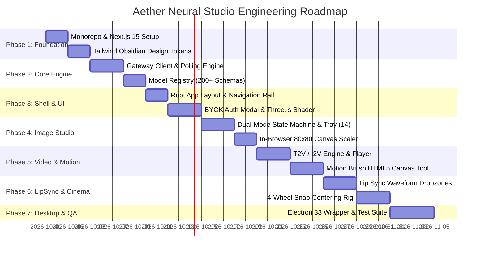

# 01. Master Implementation & Phased Execution Plan

## Executive Overview
This document defines the comprehensive master engineering roadmap for constructing **Aether Neural Studio**. Each phase establishes a discrete, testable architectural milestone with strict acceptance criteria and zero regressions.

---

## 1. Master Phased Implementation Roadmap

---

## 2. Granular Task Breakdown by Phase

### Phase 1: Workspace Foundation & Obsidian Design System
- [ ] Initialize monorepo directory layout (`apps/web`, `apps/desktop`, `packages/studio-core`).
- [ ] Configure `next.config.js` with remote image patterns (`*.muapi.ai`, `cdn.muapi.ai`).
- [ ] Implement Tailwind CSS theme extension with custom CSS variables for obsidian glassmorphism, cyan glows, and neon lime tokens.
- [ ] Configure TypeScript `tsconfig.json` paths and strict checking flags.

### Phase 2: Core Generative Gateway & Model Registry
- [ ] Implement `packages/studio-core/src/gateway/client.ts` with Axios interceptors for `x-api-key`.
- [ ] Build `packages/studio-core/src/polling/engine.ts` supporting 2000ms loop, exponential 5xx backoff, and URL normalization.
- [ ] Implement multipart file uploader with real-time `onUploadProgress` streams.
- [ ] Build comprehensive Model Registry with 200+ neural schemas and input constraints.

### Phase 3: Application Shell, BYOK Auth & WebGL Shader Viewport
- [ ] Implement responsive root layout featuring Navigation Rail, Studio Switcher, and Telemetry Footer.
- [ ] Build `BYOKAuthModal` with API key validation, local persistence, and gateway host override.
- [ ] Implement `PlasmaCanvas` in Three.js/WebGL with mouse lerp interpolation and background tab CPU throttling.
- [ ] Build `LaserFlow` animated telemetry bar and elapsed timer display.

### Phase 4: Image Studio & 14-Slot Reference Tray
- [ ] Implement Dual-Mode State Machine ($\text{T2I} \leftrightarrow \text{I2I}$).
- [ ] Build 14-slot multi-image reference tray with dynamic numbered order badges.
- [ ] Build offscreen HTML5 `<canvas>` 80x80 center-crop thumbnail generator.
- [ ] Integrate prompt enhancer style preset chips and Web Speech API dictation.
- [ ] Implement Lightbox Modal with zoom and local image history caching (`muapi_history`).

### Phase 5: Video & Motion Studio with Motion Brush
- [ ] Build Dual-Mode T2V / I2V studio interface.
- [ ] Implement duration (5s/10s/15s) and motion mode (normal/fun/spicy) selectors.
- [ ] Build interactive `MotionBrushCanvas` supporting directional arrows, trajectory vectors ($\vec{v}=[dx, dy]$), and binary mask compilation.
- [ ] Build custom looping HTML5 video player with frame-stepping and direct MP4 export.

### Phase 6: Lip Sync & Cinema 4-Wheel Studio
- [ ] Build Lip Sync studio with dual dropzones and Web Audio API waveform preview.
- [ ] Implement 4-Wheel Virtual Camera Rig (Camera, Lens, Focal Length, Aperture) with drag-to-scroll snap centering.
- [ ] Implement `compileCinemaPrompt` builder generating ACEScg 32-bit volumetric cinema tokens.
- [ ] Build 2.39:1 widescreen letterbox viewport.

### Phase 7: Electron 33 Desktop Shell & Test Suite
- [ ] Package standalone Electron 33 shell with frameless glass styling (`titleBarStyle: 'hiddenInset'`).
- [ ] Implement secure IPC bridge for native file system dialogs and external URL launching.
- [ ] Build comprehensive Vitest unit test suite covering URL normalization, model constraints, prompt compilers, and state machine transitions.

---

## 3. Acceptance Criteria & Milestone Gates

| Milestone | Key Deliverable | Strict Acceptance Criteria |
| :--- | :--- | :--- |
| **M1: Core Gateway** | `gateway/client.ts` & `polling/engine.ts` | 100% of status states (`starting`, `processing`, `completed`, `failed`) handled; URL normalization handles all 4 schema variants without throwing. |
| **M2: Image Tray** | `components/image/ReferenceTray.tsx` | Selecting 1–14 images correctly switches mode to I2I, displays numbered badges `1`..`14`, and dispatches valid `images_list` array. |
| **M3: Motion Brush** | `components/canvas/MotionBrush.tsx` | Painted canvas outputs valid binary mask PNG and vector coordinates ($dx, dy$) normalized to range $[-1.0, 1.0]$. |
| **M4: Cinema Rig** | `components/cinema/FourWheelRig.tsx` | Centered wheel items automatically update the 2.39:1 prompt compiler output in real time. |
| **M5: Desktop Shell** | `apps/desktop/main/index.ts` | Context isolation enabled, zero node integration in renderer, window spawns with frameless dark styling. |
