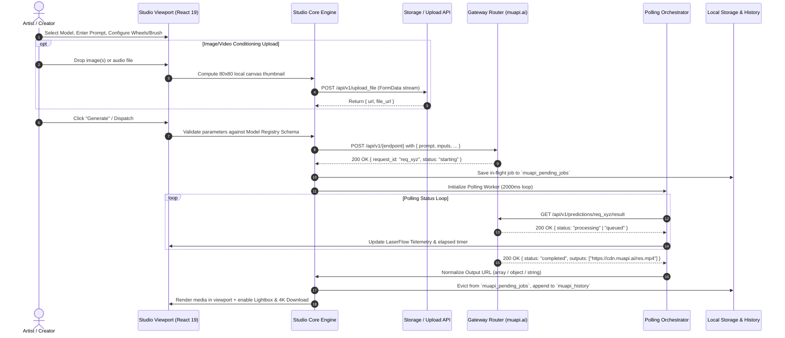

# 01. System Architecture & Engineering Topology

## Executive Overview & Architectural Objectives
**Aether Neural Studio** is a professional-grade, open-source, copyright-free neural synthesis and generative media workstation designed as an open alternative to proprietary cloud studios like Higgsfield AI. The architecture prioritizes low-latency reactive state management, clean-room protocol isolation, hardware-accelerated viewport rendering, and multi-surface deployment across modern Web browsers (Next.js 15 App Router) and standalone desktop installations (Electron 33).

---

## 1. Monorepo Topology & Project Structure

The project is structured as an enterprise-scale monorepo utilizing **pnpm workspaces** or modular subdirectories, enabling strict separation of concerns between core generative engine logic, UI view layers, and native platform bindings.

```
aether-neural-studio/
├── .agent-logs/                   # Audit logs and session telemetry
├── .agents/                      # AGY customization and lifecycle hooks
│   ├── hooks.json
│   └── scripts/
│       └── agent_capture.py
├── apps/
│   ├── web/                      # Next.js 15 (App Router) presentation layer
│   │   ├── app/
│   │   │   ├── layout.tsx
│   │   │   ├── page.tsx          # Studio root workspace switcher
│   │   │   ├── image/page.tsx    # Dual-mode Image Studio
│   │   │   ├── video/page.tsx    # Video & Motion Brush Studio
│   │   │   ├── lipsync/page.tsx  # Lip Sync & Audio-Driven Head Studio
│   │   │   └── cinema/page.tsx   # 4-Wheel Virtual Camera Studio
│   │   ├── components/
│   │   │   ├── layout/           # AppHeader, NavigationRail, TelemetryFooter
│   │   │   ├── glass/            # GlassCard, NeonBadge, GlowingButton
│   │   │   ├── canvas/           # PlasmaCanvas (Three.js/WebGL), MotionBrushCanvas
│   │   │   ├── auth/             # BYOKAuthModal, GatewayConfigModal
│   │   │   └── shared/           # HistoryDrawer, LightboxModal, UploadDropzone
│   │   ├── hooks/                # usePollingJob, useUploadManager, useWebSpeech
│   │   ├── lib/                  # WebGL shaders, math helpers, canvas scalers
│   │   └── styles/               # globals.css, theme tokens, Tailwind extensions
│   └── desktop/                  # Electron 33 wrapper & native sandbox
│       ├── main/
│       │   ├── index.ts          # BrowserWindow lifecycle & IPC dispatcher
│       │   └── security.ts       # CSP headers & permission sandboxing
│       └── preload/
│           └── index.ts          # ContextBridge native API surface
├── packages/
│   ├── studio-core/              # Platform-agnostic generative core
│   │   ├── src/
│   │   │   ├── gateway/          # HTTP client, auth interceptor, multipart uploader
│   │   │   ├── polling/          # PollingEngine, exponential backoff, job manager
│   │   │   ├── registry/         # 200+ Neural model schemas and constraints
│   │   │   ├── storage/          # LocalStorage abstractions, schema migrations
│   │   │   └── types/            # TypeScript AST and data contracts
│   │   ├── package.json
│   │   └── tsconfig.json
│   └── ui-tokens/                # Design tokens, color ramps, typography
├── specs/                        # Architectural specifications suite
└── plan/                         # Master implementation & test roadmap
```

---

## 2. Technology Stack Breakdown

| Layer | Technology | Version | Architectural Justification |
| :--- | :--- | :--- | :--- |
| **Framework** | Next.js (App Router) | 15.x | Server-side metadata rendering, zero-bundle streaming, modern React 19 transitions. |
| **View Engine** | React | 19.x | Concurrent transitions, `useActionState`, direct asset preloading, optimal ref callbacks. |
| **Styling** | Tailwind CSS | 3.4.x / 4.x | Atomic token mapping, JIT compilation, zero runtime CSS overhead, custom arbitrary properties. |
| **Graphics / Shader** | Three.js / WebGL 2.0 | r168+ | Custom GLSL fragment shader rendering for reactive ambient plasma backgrounds; GPU acceleration. |
| **Networking** | Axios / Native Fetch | 1.7.x | Interceptor pipelines for `x-api-key` header injection, upload progress streams, abort controllers. |
| **Desktop Shell** | Electron | 33.x | Cross-platform (macOS/Windows/Linux) desktop sandbox with frameless glass styling and local IPC. |
| **Language** | TypeScript | 5.6+ | Strict type safety across payload schemas, model constraints, and UI state vectors. |
| **Icons & Media** | Lucide React | 0.450+ | Consistent, lightweight SVG iconography tailored for high-density creative suites. |

---

## 3. End-to-End Generative Data Flow



---

## 4. Clean-Room Legal Boundary & Independent Implementation Compliance

To ensure complete legal compliance and open-source integrity, **Aether Neural Studio** is engineered following strict **Clean-Room Software Engineering Protocols**:

1. **Functional Equivalence Without Asset Copying**:
   - The system is built purely from observable behavioral requirements, standard media processing equations, and open API gateway contracts.
   - Zero proprietary HTML, minified JavaScript, proprietary CSS themes, or reverse-engineered client bundles from commercial closed platforms are present in this codebase.

2. **Clean Data Model & Standardized Schema**:
   - All interfaces, parameter schemas, state machine models, and UI components are original implementations written from first principles.
   - The model schemas conform to public OpenAPI / REST standards utilized by universal cloud inference hubs.

3. **Permissive Licensing**:
   - The entire codebase is licensed under the Apache 2.0 / MIT Open Source License, granting perpetual, worldwide, royalty-free usage rights for both personal and enterprise commercial production.
