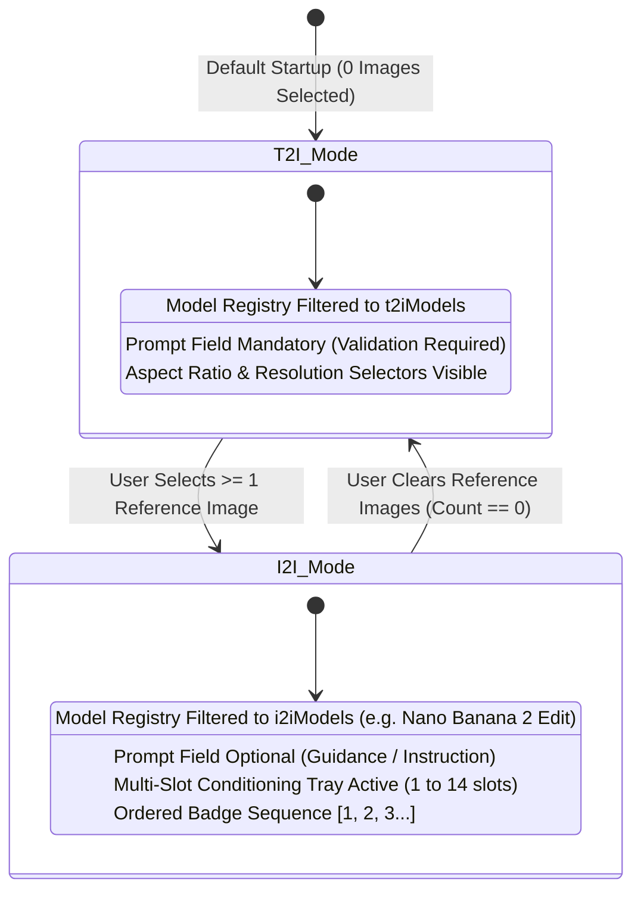

# 05. Image Studio Specification & Multi-Slot Reference Tray

## Overview & Functional Philosophy
The Image Studio is an intelligent, reactive dual-mode generative workstation. It seamlessly toggles between **Text-to-Image (T2I)** synthesis and **Multi-Reference Image-to-Image (I2I)** contextual editing based on the user's active reference tray selections.

---

## 1. Dual-Mode Reactive State Machine



### State Machine Transition Rules:
1. **Transition $\text{T2I} \rightarrow \text{I2I}$**:
   - Condition: `selectedImageIds.length > 0`.
   - Action: Active model automatically switches to `nano-banana-2-edit` (or last selected I2I model). The prompt input becomes optional.
2. **Transition $\text{I2I} \rightarrow \text{T2I}$**:
   - Condition: `selectedImageIds.length === 0`.
   - Action: Active model reverts to `flux-dev` (or last selected T2I model). The prompt input becomes strictly mandatory.

---

## 2. 14-Slot Multi-Image Reference Tray & Upload Workflow

### 2.1 Tray Topology & Conditioning Sequence
Compatible models (e.g., Nano Banana 2 Edit) support up to **14 distinct conditioning images**.
- **Numbered Order Badges**: When images are selected, each thumbnail receives a bright cyan badge indicating its 1-indexed order (`1`, `2`, `3`... `14`) in the dispatched `images_list` array.
- **Drag-to-Reorder**: Users can reorder thumbnails in the tray to adjust conditioning priority.
- **Batch Dropzone**: Supports dropping multiple PNG/JPEG/WEBP assets simultaneously.

### 2.2 Upload Modal & "Use Selected (N)" Workflow
1. User clicks `"+ Add References"` to open the Upload Asset Manager.
2. User selects multiple images from the grid of previously uploaded assets (`muapi_uploads`) or uploads fresh files from disk.
3. A sticky footer shows `"Use Selected (${count})"` with slot limit enforcement ($\le 14$).
4. Upon clicking confirm, the modal closes and the reference tray updates.

---

## 3. In-Browser 80x80 Canvas Thumbnail Generator

To ensure instant UI rendering without waiting for cloud CDN rounds, all local file drops are processed instantly through an offscreen HTML5 `<canvas>` element:

```typescript
export async function generateSquareThumbnail(file: File, size = 80): Promise<string> {
  return new Promise((resolve, reject) => {
    const reader = new FileReader();
    reader.onload = (event) => {
      const img = new Image();
      img.onload = () => {
        const canvas = document.createElement("canvas");
        canvas.width = size;
        canvas.height = size;
        const ctx = canvas.getContext("2d");
        if (!ctx) return reject("Canvas context unavailable");

        // Center-crop aspect ratio math
        const minDim = Math.min(img.width, img.height);
        const sx = (img.width - minDim) / 2;
        const sy = (img.height - minDim) / 2;

        ctx.drawImage(img, sx, sy, minDim, minDim, 0, 0, size, size);
        resolve(canvas.toDataURL("image/jpeg", 0.85));
      };
      img.onerror = reject;
      img.src = event.target?.result as string;
    };
    reader.onerror = reject;
    reader.readAsDataURL(file);
  });
}
```

---

## 4. Prompt Enhancer & Style Presets

The studio provides one-click neural prompt enhancement presets that append cinematographic tokens:

| Preset Name | Token Injection Formula |
| :--- | :--- |
| **Cyber Cinema** | `, cinematic 8k neon illumination, anamorphic 35mm lens, atmospheric volumetric haze, Blade Runner aesthetic, ultra-detailed` |
| **Photorealism** | `, raw candid photograph, Hasselblad H6D-100c, 80mm lens, f/2.8, natural directional window light, hyper-realistic skin texture` |
| **Analog 35mm** | `, shot on 35mm Kodak Portra 400 film, nostalgic color grading, subtle film grain, organic soft focus halation` |
| **Anime Master** | `, Makoto Shinkai aesthetic, Studio Ghibli vibrance, hand-painted keyframe, celestial clouds, dynamic lighting` |
| **Surreal 3D** | `, surrealist 3D digital art, Octane Render 2026, iridescent glass refractions, ethereal floating geometry, Ray Tracing` |

---

## 5. UI Controls & Viewport Layout

```
+-------------------------------------------------------------------------+
| [Header] Aether Image Studio | BYOK: Active (●) | History Drawer (📂)  |
+-------------------------------------------------------------------------+
| LEFT CONTROLS (380px)                 | MAIN VIEWPORT (Flex 1)          |
|---------------------------------------|---------------------------------|
| [Model Selector Dropdown]             | [Interactive Generation Stage]  |
|  > Nano Banana 2 Edit (14 slots) [HD] |                                 |
|                                       |   +-------------------------+   |
| [Multi-Image Reference Tray]          |   |                         |   |
|  [+ Add (14 max)] [1][2][3]           |   |   Generated 4K Output   |   |
|                                       |   |   (With Lightbox Zoom   |   |
| [Prompt Input Box]                    |   |    & Aspect Frame)      |   |
|  [Auto-grow Textarea + Dictation 🎙️] |   |                         |   |
|  [Preset Chips: Cyber | Photo | Film] |   +-------------------------+   |
|                                       |                                 |
| [Aspect Ratio & Resolution Pickers]   | [LaserFlow Telemetry Bar]       |
|  [16:9] [9:16] [1:1] [21:9] | [4K]    |  Status: Completed | 3.4s | 4K  |
|                                       |                                 |
| [Generate Button (Gradient Glow)]     | [Actions: 💾 Download | 🔍 Zoom]|
+-------------------------------------------------------------------------+
```
