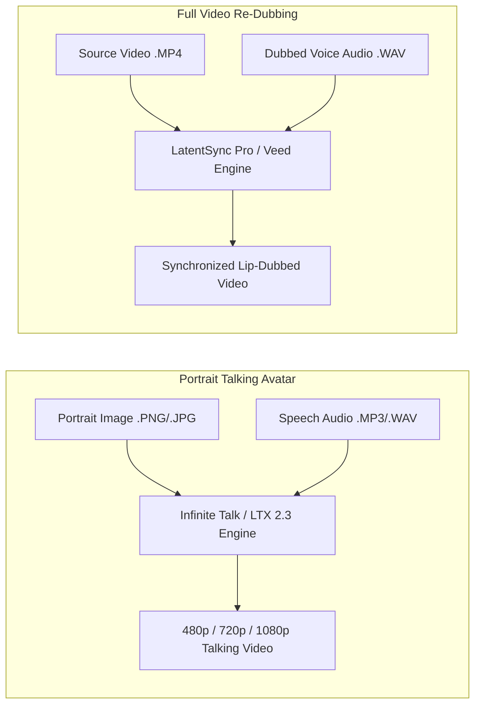

# 07. Lip Sync & Cinema 4-Wheel Studio Specification

## Overview & Architecture
This specification defines two advanced creative studios within Aether:
1. **Lip Sync & Speech Studio**: Neural audio-to-viseme temporal synthesis for portrait talking heads and video re-dubbing.
2. **Cinema Studio & 4-Wheel Rig**: Physical virtual cinematography compiler utilizing an intuitive 4-wheel optical carousel rig.

---

## 1. Lip Sync & Speech Studio Specification

### 1.1 Dual-Mode Viseme Synthesis



### 1.2 Dual Audio-Visual Dropzones & Waveform Preview
- **Visual Input Dropzone**: Supports portrait photo or MP4 video upload with instant preview.
- **Audio Input Dropzone**: Accepts MP3, WAV, M4A, OGG speech tracks up to 180 seconds.
- **In-Browser Audio Waveform Visualizer**: Renders an interactive Web Audio API frequency waveform with playback preview and scrub head.

---

## 2. Cinema Studio & 4-Wheel Virtual Camera Rig

The Cinema Studio allows directors to compose Hollywood-grade cinematographic shots by configuring physical camera, lens, focal length, and aperture parameters through 4 tactile scroll-snapping carousel wheels.

```
+-------------------------------------------------------------------------+
| CINEMA STUDIO: 4-WHEEL OPTICAL RIG                                      |
|-------------------------------------------------------------------------|
| [WHEEL 1: CAMERA BODY] [WHEEL 2: LENS GLASS]  [WHEEL 3: FOCAL] [APERTURE]|
|                                                                         |
|  Grand Format 70mm     Master Anamorphic 35mm   35mm Cine       f/1.4   |
| >Full-Frame Cine 8K<  >Large Format 65mm<      >50mm Standard< >f/2.8<  |
|  Studio Digital S35    Halation Vintage 50mm    85mm Portrait   f/8.0   |
|                                                                         |
|-------------------------------------------------------------------------|
| WIDESCREEN 2.39:1 CINEMASCOPE LETTERBOX VIEWPORT                        |
|                                                                         |
|     +-------------------------------------------------------------+     |
|     |                                                             |     |
|     |            Cinematographic 4K Master Render                 |     |
|     |                 (2.39:1 Aspect Ratio)                       |     |
|     |                                                             |     |
|     +-------------------------------------------------------------+     |
|                                                                         |
| [Compiled Cinema Prompt Preview]                                        |
| "A cyberpunk detective in rain, shot on Full-Frame Cine Digital 8K..."  |
+-------------------------------------------------------------------------+
```

### 2.1 Rig Parameter Definitions

#### Wheel 1: Camera Sensor / Stock
1. `Modular 8K Digital`: High dynamic range, hyper-clean digital colorimetry.
2. `Full-Frame Cine Digital`: Natural skin tones, subtle rolling shutter organic motion.
3. `Grand Format 70mm Film`: IMAX ultra-resolution, massive spatial clarity.
4. `Studio Digital S35`: Classic cinematic field of view, industry standard contrast.
5. `Classic 16mm Vintage Film`: Textured organic grain, warm nostalgic halation.

#### Wheel 2: Lens Architecture
1. `Master Anamorphic 35mm`: Oval bokeh, horizontal blue lens flares, 2.39:1 de-squeeze.
2. `Cine Prime 40mm`: Sharp spherical focus, minimal chromatic aberration.
3. `Large Format 65mm Glass`: Dreamy falloff, immense character, edge softness.
4. `Ultra Vista 70mm`: Monumental scale, edge-to-edge optical resolution.
5. `Halation Vintage Diffusion`: Warm glow around intense specular highlights.
6. `Tilt-Shift Architectural Lens`: Miniature perspective effect, selective planar focus.

#### Wheel 3: Focal Length ($\text{mm}$)
- `8mm` (Fish-Eye Extreme Wide)
- `14mm` (Ultra Wide Establishing Shot)
- `24mm` (Wide Environmental Perspective)
- `35mm` (Natural Street / Cinema Medium)
- `50mm` (Human Eye Standard Perspective)
- `85mm` (Tight Portrait / Flattering Depth)

#### Wheel 4: Aperture ($f\text{-stop}$)
- `f/1.4`: Razor-thin shallow depth of field, creamy circular bokeh balls.
- `f/2.8`: Classic cinematic separation between foreground subject and background.
- `f/4.0`: Balanced crispness with gentle background softening.
- `f/8.0`: Deep depth of field, architectural sharpness across layers.
- `f/11.0`: Deep focus hyper-clarity across entire frame geometry.

---

## 3. Snap-Centering Carousel Drag & Scroll Mechanics

Each carousel wheel calculates its active item dynamically using scroll offsets:

```typescript
export function getActiveWheelIndex(
  scrollOffset: number, 
  itemHeight: number, 
  totalItems: number
): number {
  const rawIndex = Math.round(scrollOffset / itemHeight);
  return Math.max(0, Math.min(totalItems - 1, rawIndex));
}
```

---

## 4. Cinematography Prompt Compiler

When a generation is initiated, the compiler executes deterministic string interpolation to produce professional director tokens:

```typescript
export interface CinemaRigConfig {
  prompt: string;
  camera: string;
  lens: string;
  focalLength: number;
  aperture: string;
}

export function compileCinemaPrompt(config: CinemaRigConfig): string {
  const { prompt, camera, lens, focalLength, aperture } = config;
  
  // Dynamic optical descriptions
  const perspective = focalLength <= 18 
    ? "ultra-wide dynamic distortion" 
    : focalLength >= 70 
      ? "compressed telephoto perspective" 
      : "natural organic perspective";

  const depthEffect = aperture.includes("1.4") || aperture.includes("2.8")
    ? "sublime cinematic bokeh, creamy shallow depth of field"
    : "crisp deep focus geometry";

  return `${prompt.trim()}, shot on a ${camera}, using a ${lens} at ${focalLength}mm (${perspective}), aperture ${aperture}, ${depthEffect}, volumetric chiaroscuro lighting, ACEScg 32-bit color pipeline, 2.39:1 aspect ratio, master cinema render`;
}
```
